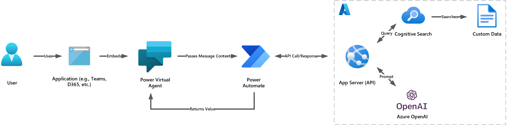
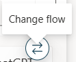

# power-platform-chatGPT

Samples for using ChatGPT and your custom data with the Power Platform.

## PVA to OpenAI

This codebase extends the example laid out in [this excellent power-platform-chatGPT guide](https://github.com/mathyousee/power-platform-chatGPT). This guide seeks to go beyond just exposing a vanilla ChatGPT deployment via Power Virtual Agents, but to tailor responses from your ChatGPT deployment using your own custom data sources. To achieve this, this guide will combine the backend deployed with [this Retrieval-Augmented Generation codebase](https://github.com/Azure-Samples/azure-search-openai-demo), which will provision a Cognitive Search, Web API, and Azure OpenAI instance.

This sample seeks to provide an easy way to try out:

- Using Power Virtual Agents for the rapid development of the bot, deployment to channels like Teams chat, and basic conversational flow
- The bot calling the Azure OpenAI service for ChatGPT capabilities (e.g. GPT 3.5 completions model) to answer questions
- Include prompt engineering to limit question scope and ensure the completions are used in line with Responsible AI principles

The use case for this sample was inspired by this Microsoft Healthcare and Life Sciences blog [Azure OpenAI ChatGPT Solves Cryptic Error Codes from Power BI, SQL Server, Power Apps, and more! - Microsoft Community Hub](https://techcommunity.microsoft.com/t5/healthcare-and-life-sciences/azure-openai-chatgpt-solves-cryptic-error-codes-from-power-bi/ba-p/3803661).

### Architecture

1. User message passed to Power Automate for pre-processing and prompt engineering
2. HTTPS call to API, which queries a semantic search on your data and further prompts Azure OpenAI completions model for a response
3. Response parsed by Power Automate
4. Message history provided to Power Virtual Agents. Response is displayed in the chat

### Deploying the sample

Prerequisites:

- Deploy the full codebase as described in [this Retrieval-Augmented Generation tutorial](https://github.com/Azure-Samples/azure-search-openai-demo). This will provision the API, search service, and Azure OpenAI model.
- Gain Environment Maker access to a Power Platform environment
  - Ensure HTTPS connector is not blocked by DLP rules

Steps:

1. Download the latest PvaToOpenAI solution file from the [Solution File History](/solution-file-history/) folder
2. Deploy the solution to a Development environment
3. Publish the solution
4. In the _Search API - Help from ChatGPT with Chat History_ cloud flow (screenshot below), edit the following placeholder value with your specific value:

   1. URI - update to use the endpoint of the App Service deployed in the [Retrieval-Augmented Generation tutorial](https://github.com/Azure-Samples/azure-search-openai-demo)
      

5. Update the Chatbot to have a 'Fallback - API' topic by making a copy of the existing Fallback system topic. In the Action step, hover your mouse over the flow, and click the 'Change flow' arrow icon to use the Search API flow. Then, set the Power Automate inputs as follows:

    

   1. Input update:

      

      - LastMessage.Text can be found under 'System'
      - Global.MessageHistory and Global.SystemMessage can be found under 'Custom'

   3. Update the Multiple Topics Matched topic to use the newly updated Fallback API topic. After updating, it will look like this:

      

6. Update your authentication settings. The Bot is set to 'Teams authentication' by default.
7. Publish the _PVA-OpenAI_ bot
8. Deploy the bot to a channel (e.g. Teams channel, Dynamics 365, Power App, etc.)

### Security considerations

- For improved security, the [API and OpenAI services deployed in Azure may be best deployed as a backend of an Azure API Management instance](https://github.com/Azure-Samples/openai-python-enterprise-logging), so that another layer of security can be added between your client and backend. This will also enable the backend components to be secured on a virtual network, prohibiting your backend services from being publicly routable. Moreover, to add additional security between your backend services and Power Platform components, you can use a Web Application Firewall on [Azure Front Door](https://learn.microsoft.com/en-us/azure/web-application-firewall/afds/afds-overview) or [Application Gateway](https://learn.microsoft.com/en-us/azure/web-application-firewall/ag/ag-overview) configured with [custom prevention rules](https://learn.microsoft.com/en-us/azure/web-application-firewall/ag/create-custom-waf-rules) to forbid requests that do not match variables like URIs, headers, IP address ranges, and more.

- 

### Additonal notes and considerations

- This sample is provided as a learning tool to easily try out the capability, not presented as a final solution
- The ChatGPT model is leveraged in the Power Virtual Agent as a _fallback_ for when a structured Topic or Conversation Booster does not exist.
- As this is non-production sample, the API key is stored directly in the flow definition, KeyVault is a more secure approach.
- This is structured to use Azure OpenAI, keeping control over the data passed to the service and ensuring the contents are not used to train vendors' models. Consider storing your own history in Azure for your own future training and refinement.
- There is some basic message pre-processing to strip out certain characters that a user can type in. Consider adding additional steps to this preprocessing.
- There is basic message history that is included so ChatGPT can have context. Consider limiting the amount of history to ensure information is not lost in the prompt to the completion model.
- Why not just use the UI deployed in the [Retrieval-Augmented Generation tutorial](https://github.com/Azure-Samples/azure-search-openai-demo)? While the chat interface in the tutorial is well-made and provides a full set of features, there are a few things to keep in mind that might make Power Virtual Agents a better choice:
  - The maintenance and customization of the UI requires more specialized knowledge
  - It may not integrate well with tools like Teams or Power Apps since it's a standard web application
  - The Virtual Agent's integration with Power Automate allows you to easily add additional automations/logical flows based on conversation topics
  - Power Virtual agents has out-of-the-box authentication mechanisms

  If you have the capacity and need to maintain and further customize the UI codebase without a need to integrate with tools like Power Apps or Teams and don't want to build conversation-driven automations with Power Automate (and would instead prefer to opt for a service like Logic Apps), then the UI deployed in the Retrieval-Augmented Generation tutorial may be a better solution for you.
